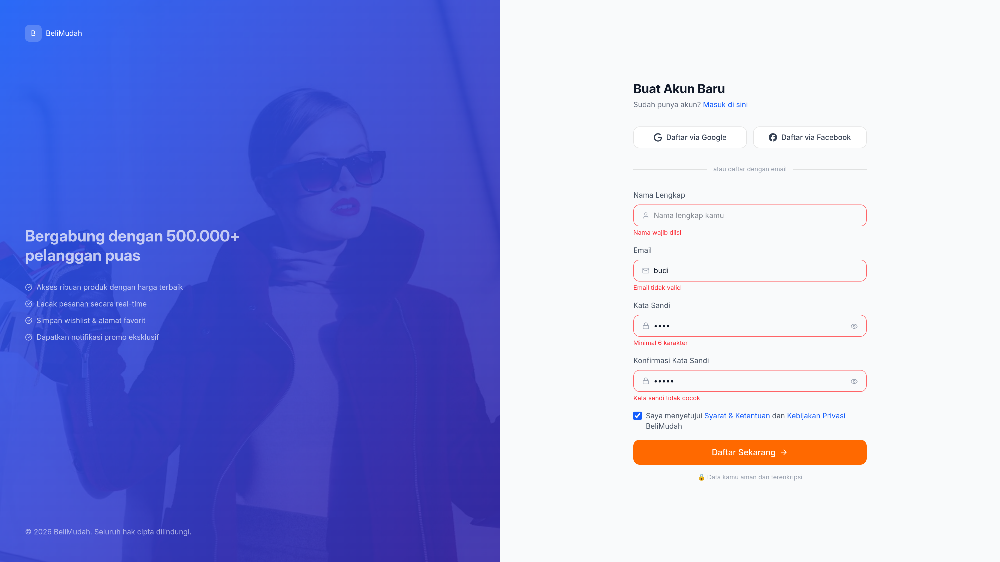
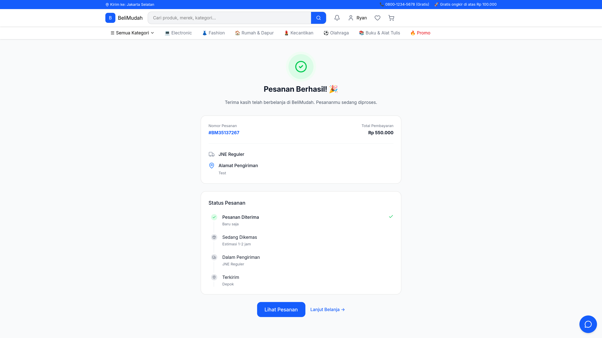

# BeliMudah

A full e-commerce frontend (storefront through admin dashboard), built solo from a shared Figma brief as the final project for Koda Academy (Fullstack track, Batch 8).

The build prioritises faithful translation of the design system and a small set of defended engineering decisions:
type-checked JavaScript without a compile step, design tokens encoded directly in the stylesheet, and a consolidated build toolchain.

> [!NOTE]
> The UI copy is in Indonesian (the target market for the brief). The codebase and documentation are in English.

## Screenshot





## Tech stack

- **React 19** for the UI
- **React Router 8** (`createBrowserRouter`, lazy routes)
- **Tailwind CSS v4** (CSS-first `@theme` config)
- **Vite**, via **vite-plus** (a Vite superset with lint and format built in)
- **unplugin-icons** (Lucide, Simple Icons)
- **JSDoc with `checkJs`** for typing (no TypeScript compile step)
- **oxlint, oxfmt** for lint and format (bundled in vite-plus)
- **TanStack Table 8** for the admin data tables
- **Recharts 3** for the admin dashboard charts

## Features

### Storefront

- Landing page: hero carousel, category grid, flash deals, newest and featured products
- Product browse with price, category, rating, and availability filters
- Product detail with variant selection and related products
- Cart with quantity stepper and promo-code field
- Multi-step checkout (shipping, payment, confirmation, success) with a stateful stepper
- Account area: profile, order history, wishlist, addresses, payment methods
- Auth flows: login, register, forgot password

### Admin

> [!WARNING]
> This section is not finished and currently only show static preview.

- Dashboard: KPI cards, revenue area chart, category donut, recent orders, top products
- Product management: searchable / filterable table, summary stats, add-product modal
- Order management: status tabs, filtering, per-row actions
- Customer management: growth chart, tiered customer table
- Settings

## Usage

```bash
# install
bun install

# start the dev server
bun run dev

# production build
bun run build
```

Other scripts: `bun run lint`, `bun run fmt`, `bun run test`.

## Structure

```tree
src/
├── +Layout.jsx              # root layout
├── main.jsx                 # router definition + entry
├── style.css                # design tokens (@theme) + component layer
├── data.json                # mock data (products, categories, admin)
├── components/              # shared UI (cards, badges, form fields, ...)
│   └── admin/               # admin-only primitives (DataTable, StatCard)
├── hooks/                   # useCheckout, ...
├── lib/                     # utils (cn, rupiah, slugify), status maps
└── pages/
    ├── (store)/             # storefront + nested (account) area
    ├── (auth)/              # login, register, forgot-password
    └── admin/               # dashboard, products, orders, customers, settings
```

Route groups in parentheses (`(store)`, `(auth)`, `(account)`) organise the tree without adding URL segments. The `#/` prefix is a path alias to `src/`, declared once in `package.json` (`imports`) and mirrored in `jsconfig.json`.

## Scope

This is a frontend project. All data is static (`src/data.json`); there is no backend, and the auth and form flows are presentational.
The focus is on UI fidelity to the brief, component architecture, and the styling system.

## License

This project is licensed under [MIT](LICENSE).  
Copyright © Ryan Suhartanto <suhartanto@kekkon.nexus>.
